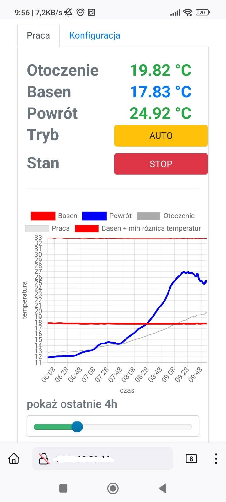

# The private project for the temperature monitoring and heating in the garden pool using raspberry pi (zero)

This is my first Python project.

The main aim of the software is to control the water pump which pushes water through solar-heated pipes.

A service written in Python is a backend and web application written in PHP/bootstrap/js as a UI.

Updates are sent using WebSocket, control uses REST API. Authorization was totally omitted because the system works locally behind the VPN

